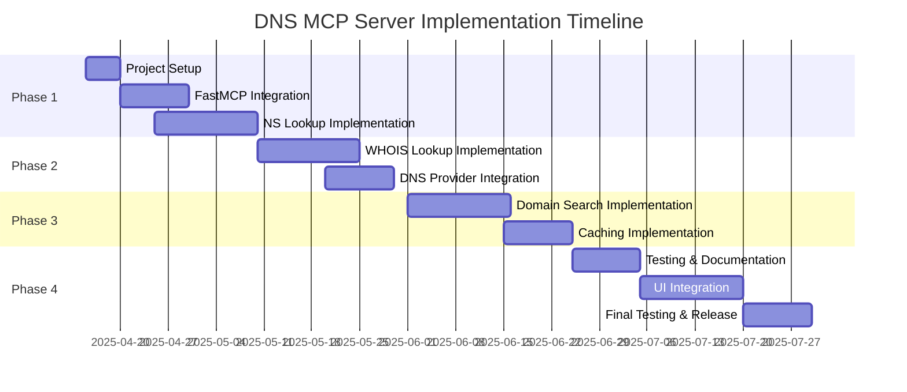
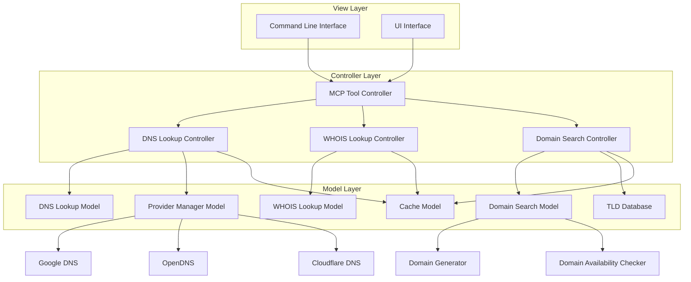
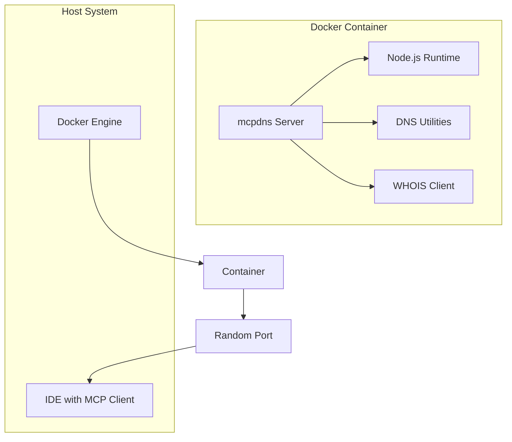

# DNS MCP Server Implementation Plan

## 1. Introduction

This document provides a high-level implementation plan for the DNS MCP Server based on the specifications in the `docs` directory. The plan outlines the implementation phases, key tasks, dependencies, and suggested timeline.

## 2. Implementation Phases

The implementation will follow a phased approach to deliver incremental value:

### Phase 1: Core Framework and NS Lookup (4 weeks)

- Set up project structure and dependencies
- Implement FastMCP server integration
- Develop NS record lookup functionality
- Integrate with Google DNS provider
- Create Docker containerization

### Phase 2: WHOIS and Additional Providers (3 weeks)

- Implement WHOIS lookup functionality
- Add OpenDNS and Cloudflare DNS providers
- Implement provider selection and comparison

### Phase 3: Domain Search and Caching (4 weeks)

- Implement domain search functionality
- Develop domain hack generation algorithms
- Create TLD database and filtering
- Implement optional caching functionality

### Phase 4: Testing, UI Integration and Release (4 weeks)

- Develop comprehensive test suite
- Create user documentation
- Implement UI components for IDE integration
- Conduct final testing and bug fixes
- Prepare for release

## 3. Key Tasks Breakdown

### 3.1 Project Setup

1. Initialize project repository
2. Set up development environment
3. Install dependencies
4. Configure build system
5. Set up testing framework
6. Create initial project structure
7. Set up Docker containerization

### 3.2 FastMCP Integration

1. Implement FastMCP server configuration
2. Define tool schemas
3. Set up request/response handling
4. Implement error handling
5. Create server discovery mechanism

### 3.3 NS Lookup Implementation

1. Develop DNS lookup model
2. Implement NS record parsing
3. Create DNS lookup controller
4. Define NS lookup tool
5. Implement result formatting
6. Add error handling

### 3.4 WHOIS Lookup Implementation

1. Develop WHOIS lookup model
2. Implement WHOIS server connection
3. Create WHOIS data parsing
4. Define WHOIS lookup tool
5. Implement result formatting
6. Add error handling

### 3.5 DNS Provider Integration

1. Implement Provider Manager
2. Develop Google DNS provider
3. Develop OpenDNS provider
4. Develop Cloudflare DNS provider
5. Implement provider selection logic
6. Create result comparison functionality

### 3.6 Domain Search Implementation

1. Develop TLD database
2. Implement domain name generation algorithms
3. Create domain hack detection and generation
4. Implement keyword-based domain suggestion
5. Integrate with domain availability checking
6. Develop result ranking and filtering

### 3.7 Caching Implementation

1. Develop Cache Manager
2. Implement Memory Store
3. Implement Disk Store
4. Create cache key generation
5. Implement TTL management
6. Integrate caching with lookup services

### 3.8 UI Integration

1. Design UI components
2. Implement command-line interface
3. Create UI metadata for tools
4. Develop result visualization
5. Implement user preferences

### 3.9 Docker Containerization

1. Create Dockerfile for the application
2. Set up Docker Compose configuration
3. Configure container networking with random port assignment
4. Include DNS utilities in the container
5. Implement volume mounting for development
6. Create container documentation
7. Set up CI/CD pipeline for container builds

## 4. Dependencies

### 4.1 External Dependencies

- fastmcp framework
- DNS resolution libraries
- WHOIS client libraries
- HTTP client for DNS-over-HTTPS
- Caching libraries
- Testing frameworks
- Docker and Docker Compose

### 4.2 Internal Dependencies

| Component | Depends On |
|-----------|------------|
| NS Lookup | FastMCP Integration, Provider Manager |
| WHOIS Lookup | FastMCP Integration |
| Provider Integration | NS Lookup |
| Domain Search | FastMCP Integration, TLD Database |
| Caching | NS Lookup, WHOIS Lookup, Domain Search |
| UI Integration | All previous components |
| Docker Containerization | Project Setup |

## 5. Development Approach

### 5.1 Architecture

The implementation will follow the MVC (Model-View-Controller) pattern as outlined in the specifications:

### 5.2 Coding Standards

- Use TypeScript for type safety
- Follow ESLint and Prettier configurations
- Write comprehensive unit tests
- Document all public APIs
- Use async/await for asynchronous operations
- Implement proper error handling

### 5.3 Testing Strategy

- Unit tests for all components
- Integration tests for end-to-end flows
- Performance tests for response time validation
- Error handling tests
- UI component tests
- Container tests for Docker deployment

### 5.4 Containerization Strategy

The application will be containerized using Docker to ensure consistent deployment and execution environments:

Key containerization features:

1. **Base Image**: Node.js Alpine for minimal footprint
2. **Included Utilities**: nslookup, dig, whois
3. **Port Management**: Random port assignment to avoid conflicts
4. **Volume Mounting**: For development and configuration
5. **Environment Variables**: For runtime configuration
6. **Restart Policy**: Automatic restart on failure

## 6. Risks and Mitigations

| Risk | Impact | Probability | Mitigation |
|------|--------|-------------|------------|
| FastMCP framework limitations | High | Medium | Early prototyping, fallback options |
| DNS provider API changes | Medium | Low | Abstract provider interfaces, monitoring |
| Performance issues with multiple providers | Medium | Medium | Implement timeouts, parallel requests |
| Caching complexity | Medium | Medium | Start with simple in-memory cache, expand later |
| WHOIS server rate limiting | High | High | Implement backoff strategy, use multiple sources |
| Domain availability API rate limits | High | High | Implement caching, queuing, and rate limiting |
| TLD database maintenance | Medium | Medium | Implement automated updates, fallback to manual updates |
| Container networking issues | Medium | Low | Use random port assignment, implement health checks |
| Docker compatibility across environments | Medium | Low | Use widely supported Docker features, test on multiple platforms |

## 7. Success Criteria

The implementation will be considered successful when:

1. All specified features are implemented and working correctly
2. Response times meet the performance targets specified in the docs
3. The system handles errors gracefully
4. The UI provides a good user experience
5. The code is well-tested and documented
6. The Docker container runs reliably on different environments
7. The container starts with minimal configuration

## 8. Future Considerations

After the initial implementation, consider:

1. Adding support for additional DNS record types (A, AAAA, MX)
2. Implementing email configuration verification
3. Adding DKIM, SPF, and DMARC verification
4. Enhancing domain search with AI-powered suggestions
5. Implementing domain purchase functionality
6. Adding domain transfer and management capabilities
7. Implementing authentication and user management
8. Creating a web-based administration interface
9. Setting up a container registry for easier distribution

## 9. Resources

### 9.1 Documentation

- [SPEC-dns-mcp-overview-001.md](./SPEC-dns-mcp-overview-001.md)
- [SPEC-dns-mcp-fastmcp-integration-001.md](./SPEC-dns-mcp-fastmcp-integration-001.md)
- [SPEC-dns-mcp-ns-lookup-001.md](./SPEC-dns-mcp-ns-lookup-001.md)
- [SPEC-dns-mcp-whois-001.md](./SPEC-dns-mcp-whois-001.md)
- [SPEC-dns-mcp-providers-001.md](./SPEC-dns-mcp-providers-001.md)
- [SPEC-dns-mcp-domain-search-001.md](./SPEC-dns-mcp-domain-search-001.md)
- [SPEC-dns-mcp-caching-001.md](./SPEC-dns-mcp-caching-001.md)
- [SPEC-dns-mcp-future-001.md](./SPEC-dns-mcp-future-001.md)

### 9.2 External References

- [FastMCP Framework](https://github.com/punkpeye/fastmcp)
- [DNS-over-HTTPS Protocol](https://developers.google.com/speed/public-dns/docs/doh)
- [WHOIS Protocol RFC 3912](https://tools.ietf.org/html/rfc3912)
- [Model Context Protocol](https://github.com/microsoft/model-context-protocol)
- [ICANN TLD List](https://www.icann.org/resources/pages/tlds-2012-02-25-en)
- [Domain Hacks List](https://domainhacks.info/)
- [Docker Documentation](https://docs.docker.com/)
- [Docker Compose Documentation](https://docs.docker.com/compose/)

## 10. Conclusion

This implementation plan provides a roadmap for developing the DNS MCP Server based on the detailed specifications. By following this phased approach, the implementation can deliver incremental value while managing complexity and risks. The containerization strategy ensures consistent deployment and execution environments, making it easier for users to run the server without conflicts with other services.