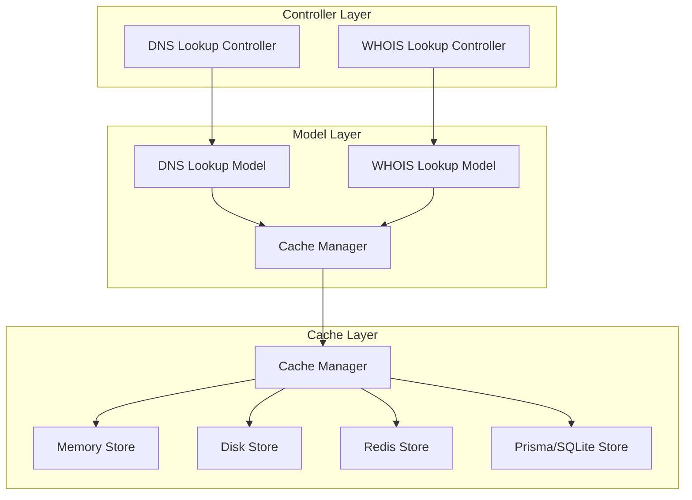

# Optional Caching Functionality

## 1. Introduction

The optional caching functionality is a performance-enhancing component of the DNS MCP Server that allows users to store and reuse DNS and WHOIS lookup results. This document details the design, implementation, and usage of this feature, focusing on providing a configurable caching mechanism that users can enable or disable as needed.

## 2. Feature Overview

Caching stores the results of DNS and WHOIS lookups to reduce the need for repeated external queries, improving response times and reducing load on external services. The caching system is designed to be optional, allowing users to choose whether to use cached results or always perform fresh lookups.

### 2.1 Key Capabilities

- Store and retrieve DNS and WHOIS lookup results
- User control over cache usage (enable/disable)
- Respect TTL (Time To Live) values from DNS records
- Configurable cache expiration for WHOIS data
- Cache invalidation mechanisms
- Memory, disk-based, Redis, and SQLite (via Prisma) storage options

### 2.2 Use Cases

- Improving response times for frequently queried domains
- Reducing load on external DNS and WHOIS servers
- Working offline with previously cached results
- Comparing current results with cached results to detect changes
- Reducing API usage for services with rate limits

## 3. Implementation Details

### 3.1 Component Architecture



### 3.2 Cache Manager

The Cache Manager is the central component responsible for:
- Managing cache storage backends
- Handling cache operations (get, set, invalidate)
- Enforcing TTL and expiration policies
- Providing a consistent interface for all caching operations

```typescript
class CacheManager {
  private stores: Map<string, CacheStore>;
  private defaultStore: string;
  private config: CacheConfig;

  constructor(config: CacheConfig) {
    this.stores = new Map();
    this.config = config;
    this.defaultStore = config.defaultStore || 'memory';
    
    // Initialize stores
    if (config.memory) {
      this.stores.set('memory', new MemoryStore(config.memory));
    }
    
    if (config.disk) {
      this.stores.set('disk', new DiskStore(config.disk));
    }
    
    if (config.redis) {
      this.stores.set('redis', new RedisStore(config.redis));
    }

    if (config.prisma) {
      this.stores.set('prisma', new PrismaCacheStore(config.prisma));
    }
  }

  async get<T>(key: string, options?: CacheGetOptions): Promise<CacheResult<T> | null> {
    const storeName = options?.store || this.defaultStore;
    const store = this.getStore(storeName);
    
    const result = await store.get<T>(key);
    
    if (!result) {
      return null;
    }
    
    // Check if the result is expired
    if (this.isExpired(result)) {
      await this.invalidate(key, { store: storeName });
      return null;
    }
    
    return result;
  }

  async set<T>(
    key: string,
    value: T,
    options?: CacheSetOptions
  ): Promise<void> {
    const storeName = options?.store || this.defaultStore;
    const store = this.getStore(storeName);
    
    const ttl = options?.ttl || this.config.defaultTTL || 3600;
    const expiresAt = Date.now() + ttl * 1000;
    
    const cacheItem: CacheItem<T> = {
      key,
      value,
      createdAt: Date.now(),
      expiresAt,
      metadata: options?.metadata || {}
    };
    
    await store.set(key, cacheItem);
  }

  async invalidate(key: string, options?: CacheInvalidateOptions): Promise<void> {
    const storeName = options?.store || this.defaultStore;
    const store = this.getStore(storeName);
    
    await store.delete(key);
  }

  async invalidateAll(options?: CacheInvalidateOptions): Promise<void> {
    const storeName = options?.store || this.defaultStore;
    const store = this.getStore(storeName);
    
    await store.clear();
  }

  private getStore(name: string): CacheStore {
    const store = this.stores.get(name);
    if (!store) {
      throw new Error(`Cache store '${name}' not found`);
    }
    return store;
  }

  private isExpired<T>(item: CacheItem<T>): boolean {
    return item.expiresAt < Date.now();
  }
}
```

### 3.3 Cache Store Interface

All cache stores implement a common interface:

```typescript
interface CacheStore {
  get<T>(key: string): Promise<CacheItem<T> | null>;
  set<T>(key: string, item: CacheItem<T>): Promise<void>;
  delete(key: string): Promise<void>;
  clear(): Promise<void>;
  has(key: string): Promise<boolean>;
  keys(): Promise<string[]>;
  size(): Promise<number>;
}

interface CacheItem<T> {
  key: string;
  value: T;
  createdAt: number;
  expiresAt: number;
  metadata?: Record<string, any>;
}

type CacheResult<T> = CacheItem<T>;
```

### 3.4 Cache Store Implementations

#### 3.4.1 Memory Store

```typescript
class MemoryStore implements CacheStore {
  private cache: Map<string, any>;
  private config: MemoryStoreConfig;

  constructor(config: MemoryStoreConfig = {}) {
    this.cache = new Map();
    this.config = {
      maxItems: config.maxItems || 1000,
      ...config
    };
  }

  async get<T>(key: string): Promise<CacheItem<T> | null> {
    const item = this.cache.get(key) as CacheItem<T>;
    return item || null;
  }

  async set<T>(key: string, item: CacheItem<T>): Promise<void> {
    // Enforce max items limit with LRU eviction
    if (this.cache.size >= this.config.maxItems && !this.cache.has(key)) {
      const oldestKey = this.findOldestKey();
      if (oldestKey) {
        this.cache.delete(oldestKey);
      }
    }
    
    this.cache.set(key, item);
  }

  async delete(key: string): Promise<void> {
    this.cache.delete(key);
  }

  async clear(): Promise<void> {
    this.cache.clear();
  }

  async has(key: string): Promise<boolean> {
    return this.cache.has(key);
  }

  async keys(): Promise<string[]> {
    return Array.from(this.cache.keys());
  }

  async size(): Promise<number> {
    return this.cache.size;
  }

  private findOldestKey(): string | null {
    let oldestKey: string | null = null;
    let oldestTime = Infinity;
    
    for (const [key, item] of this.cache.entries()) {
      if (item.createdAt < oldestTime) {
        oldestTime = item.createdAt;
        oldestKey = key;
      }
    }
    
    return oldestKey;
  }
}
```

#### 3.4.2 Disk Store

```typescript
class DiskStore implements CacheStore {
  private basePath: string;
  private config: DiskStoreConfig;

  constructor(config: DiskStoreConfig) {
    this.basePath = config.path || './cache';
    this.config = {
      maxSizeMB: config.maxSizeMB || 100,
      ...config
    };
    
    // Ensure cache directory exists
    if (!fs.existsSync(this.basePath)) {
      fs.mkdirSync(this.basePath, { recursive: true });
    }
  }

  async get<T>(key: string): Promise<CacheItem<T> | null> {
    const filePath = this.getFilePath(key);
    
    if (!fs.existsSync(filePath)) {
      return null;
    }
    
    try {
      const data = await fs.promises.readFile(filePath, 'utf8');
      return JSON.parse(data) as CacheItem<T>;
    } catch (error) {
      console.error(`Error reading cache file: ${error.message}`);
      return null;
    }
  }

  async set<T>(key: string, item: CacheItem<T>): Promise<void> {
    const filePath = this.getFilePath(key);
    
    // Check if we need to enforce size limits
    if (this.config.maxSizeMB) {
      await this.enforceStorageLimit();
    }
    
    try {
      await fs.promises.writeFile(
        filePath,
        JSON.stringify(item),
        'utf8'
      );
    } catch (error) {
      console.error(`Error writing cache file: ${error.message}`);
    }
  }

  async delete(key: string): Promise<void> {
    const filePath = this.getFilePath(key);
    
    if (fs.existsSync(filePath)) {
      await fs.promises.unlink(filePath);
    }
  }

  async clear(): Promise<void> {
    const files = await fs.promises.readdir(this.basePath);
    
    for (const file of files) {
      if (file.endsWith('.cache')) {
        await fs.promises.unlink(path.join(this.basePath, file));
      }
    }
  }

  async has(key: string): Promise<boolean> {
    const filePath = this.getFilePath(key);
    return fs.existsSync(filePath);
  }

  async keys(): Promise<string[]> {
    const files = await fs.promises.readdir(this.basePath);
    return files
      .filter(file => file.endsWith('.cache'))
      .map(file => file.slice(0, -6)); // Remove .cache extension
  }

  async size(): Promise<number> {
    const files = await fs.promises.readdir(this.basePath);
    return files.filter(file => file.endsWith('.cache')).length;
  }

  private getFilePath(key: string): string {
    // Create a safe filename from the key
    const safeKey = key.replace(/[^a-z0-9]/gi, '_').toLowerCase();
    return path.join(this.basePath, `${safeKey}.cache`);
  }

  private async enforceStorageLimit(): Promise<void> {
    const files = await fs.promises.readdir(this.basePath);
    const cacheFiles = files.filter(file => file.endsWith('.cache'));
    
    if (cacheFiles.length === 0) {
      return;
    }
    
    // Calculate total size
    let totalSize = 0;
    const fileStats: { path: string; size: number; mtime: Date }[] = [];
    
    for (const file of cacheFiles) {
      const filePath = path.join(this.basePath, file);
      const stats = await fs.promises.stat(filePath);
      totalSize += stats.size;
      fileStats.push({
        path: filePath,
        size: stats.size,
        mtime: stats.mtime
      });
    }
    
    // Convert MB to bytes
    const maxSizeBytes = this.config.maxSizeMB * 1024 * 1024;
    
    if (totalSize <= maxSizeBytes) {
      return;
    }
    
    // Sort by last modified (oldest first)
    fileStats.sort((a, b) => a.mtime.getTime() - b.mtime.getTime());
    
    // Delete oldest files until we're under the limit
    let currentSize = totalSize;
    for (const file of fileStats) {
      if (currentSize <= maxSizeBytes) {
        break;
      }
      
      await fs.promises.unlink(file.path);
      currentSize -= file.size;
    }
  }
}
```

#### 3.4.3 Redis Store (Optional)

```typescript
class RedisStore implements CacheStore {
  private client: Redis;
  private prefix: string;

  constructor(config: RedisStoreConfig) {
    this.client = new Redis(config);
    this.prefix = config.prefix || 'dns-mcp:cache:';
  }

  async get<T>(key: string): Promise<CacheItem<T> | null> {
    const data = await this.client.get(this.getKey(key));
    
    if (!data) {
      return null;
    }
    
    try {
      return JSON.parse(data) as CacheItem<T>;
    } catch (error) {
      console.error(`Error parsing cache data: ${error.message}`);
      return null;
    }
  }

  async set<T>(key: string, item: CacheItem<T>): Promise<void> {
    const ttl = Math.ceil((item.expiresAt - Date.now()) / 1000);
    
    if (ttl <= 0) {
      return;
    }
    
    await this.client.set(
      this.getKey(key),
      JSON.stringify(item),
      'EX',
      ttl
    );
  }

  async delete(key: string): Promise<void> {
    await this.client.del(this.getKey(key));
  }

  async clear(): Promise<void> {
    const keys = await this.client.keys(`${this.prefix}*`);
    
    if (keys.length > 0) {
      await this.client.del(...keys);
    }
  }

  async has(key: string): Promise<boolean> {
    return (await this.client.exists(this.getKey(key))) === 1;
  }

  async keys(): Promise<string[]> {
    const keys = await this.client.keys(`${this.prefix}*`);
    return keys.map(key => key.slice(this.prefix.length));
  }

  async size(): Promise<number> {
    const keys = await this.client.keys(`${this.prefix}*`);
    return keys.length;
  }

  private getKey(key: string): string {
    return `${this.prefix}${key}`;
  }
}
```

#### 3.4.4 Prisma/SQLite Store (Optional)

This store uses Prisma ORM with a SQLite database file for persistent caching.

##### Prisma Schema (`schema.prisma`)

```prisma
// schema.prisma
datasource db {
  provider = "sqlite"
  url      = env("DATABASE_URL") // e.g., "file:./cache.db"
}

generator client {
  provider = "prisma-client-js"
}

model CacheItem {
  key       String    @id
  value     Json      // Store the cached value as JSON
  createdAt DateTime  @default(now())
  expiresAt DateTime
  metadata  Json?     // Store optional metadata as JSON

  @@index([expiresAt])
}

```

##### PrismaCacheStore Implementation

```typescript
import { PrismaClient, CacheItem as PrismaCacheItem } from '@prisma/client';

// Define configuration for Prisma store
interface PrismaStoreConfig {
  databaseUrl: string; // Path to the SQLite file, e.g., "file:./cache.db"
  cleanupInterval?: number; // Optional interval in ms for cleaning expired items
}

class PrismaCacheStore implements CacheStore {
  private prisma: PrismaClient;
  private config: PrismaStoreConfig;
  private cleanupIntervalId?: NodeJS.Timeout;

  constructor(config: PrismaStoreConfig) {
    this.config = config;
    this.prisma = new PrismaClient({
      datasources: {
        db: {
          url: this.config.databaseUrl,
        },
      },
    });

    if (config.cleanupInterval) {
      this.cleanupIntervalId = setInterval(
        () => this.cleanupExpired(),
        config.cleanupInterval
      );
      // Ensure cleanup runs on startup as well
      this.cleanupExpired().catch(err => console.error("Initial cache cleanup failed:", err));
    }
  }

  async get<T>(key: string): Promise<CacheItem<T> | null> {
    const item = await this.prisma.cacheItem.findUnique({
      where: { key },
    });

    if (!item) {
      return null;
    }

    // Check for expiration (though periodic cleanup should handle most)
    if (new Date(item.expiresAt) < new Date()) {
      await this.delete(key); // Delete if found expired during get
      return null;
    }

    return this.mapPrismaItemToCacheItem(item);
  }

  async set<T>(key: string, item: CacheItem<T>): Promise<void> {
    await this.prisma.cacheItem.upsert({
      where: { key },
      update: {
        value: item.value as any, // Prisma expects Json type
        createdAt: new Date(item.createdAt),
        expiresAt: new Date(item.expiresAt),
        metadata: item.metadata as any || null,
      },
      create: {
        key: item.key,
        value: item.value as any,
        createdAt: new Date(item.createdAt),
        expiresAt: new Date(item.expiresAt),
        metadata: item.metadata as any || null,
      },
    });
  }

  async delete(key: string): Promise<void> {
    try {
        // Use deleteMany to avoid error if item doesn't exist
        await this.prisma.cacheItem.deleteMany({
            where: { key },
        });
    } catch (error) {
        // Prisma might throw if the item is already gone, ignore.
        // Log other potential errors.
        if (error.code !== 'P2025') { // P2025: Record to delete does not exist.
             console.error(`Error deleting cache key ${key}:`, error);
        }
    }
  }

  async clear(): Promise<void> {
    await this.prisma.cacheItem.deleteMany({});
  }

  async has(key: string): Promise<boolean> {
    const count = await this.prisma.cacheItem.count({
      where: { key },
    });
    return count > 0;
  }

  async keys(): Promise<string[]> {
    const items = await this.prisma.cacheItem.findMany({
      select: { key: true },
    });
    return items.map(item => item.key);
  }

  async size(): Promise<number> {
    return this.prisma.cacheItem.count();
  }

  async cleanupExpired(): Promise<void> {
    const now = new Date();
    try {
      const deleted = await this.prisma.cacheItem.deleteMany({
        where: {
          expiresAt: {
            lt: now, // Less than now means expired
          },
        },
      });
      if (deleted.count > 0) {
        console.log(`Cleaned up ${deleted.count} expired cache items.`);
      }
    } catch (error) {
       console.error("Error during cache cleanup:", error);
    }
  }

  // Helper to map Prisma's model to our CacheItem interface
  private mapPrismaItemToCacheItem<T>(item: PrismaCacheItem): CacheItem<T> {
    return {
      key: item.key,
      value: item.value as T,
      createdAt: item.createdAt.getTime(),
      expiresAt: item.expiresAt.getTime(),
      metadata: item.metadata as Record<string, any> || undefined,
    };
  }

  // Ensure Prisma client disconnects gracefully
  async disconnect(): Promise<void> {
      if (this.cleanupIntervalId) {
          clearInterval(this.cleanupIntervalId);
      }
      await this.prisma.$disconnect();
  }
}
```

### 3.5 Cache Key Generation

Cache keys are generated based on the query parameters to ensure uniqueness:

```typescript
function generateDNSCacheKey(domain: string, recordType: string, provider: string): string {
  return `dns:${recordType}:${domain}:${provider}`;
}

function generateWHOISCacheKey(domain: string): string {
  return `whois:${domain}`;
}
```

### 3.6 TTL Management

TTL (Time To Live) values are managed as follows:

1. **DNS Records**: Use the TTL value from the DNS response
2. **WHOIS Data**: Use a configurable default TTL (typically 24 hours)
3. **Default TTL**: For other data types, use the system default TTL

```typescript
function determineTTL(
  type: 'dns' | 'whois',
  data: any,
  config: CacheConfig
): number {
  if (type === 'dns' && data.records && data.records.length > 0) {
    // Use the minimum TTL from all records
    const minTTL = Math.min(...data.records.map(record => record.ttl));
    return minTTL;
  }
  
  if (type === 'whois') {
    return config.whoisTTL || 86400; // 24 hours
  }
  
  return config.defaultTTL || 3600; // 1 hour
}
```

## 4. User Control

### 4.1 Cache Control in API Requests

Users can control caching behavior through the `useCache` parameter in API requests:

```javascript
// Example request with cache control
{
  "domain": "example.com",
  "recordType": "NS",
  "provider": "google",
  "useCache": true  // Enable cache usage
}
```

### 4.2 Cache Control in Configuration

Global cache settings can be configured:

```javascript
// Example cache configuration including Prisma/SQLite
const cacheConfig = {
  enabled: true,
  defaultStore: 'prisma', // Make Prisma the default
  defaultTTL: 3600, // 1 hour
  whoisTTL: 86400, // 24 hours
  memory: { // Can still configure other stores
    maxItems: 500
  },
  disk: {
    path: './cache_files',
    maxSizeMB: 50
  },
  prisma: {
    databaseUrl: process.env.CACHE_DATABASE_URL || 'file:./mcpdns-cache.db',
    cleanupInterval: 60 * 60 * 1000 // Cleanup expired items every hour
  }
  // redis config could also be here
};
```

### 4.3 Cache Invalidation

Users can invalidate cache entries:

```javascript
// Example cache invalidation request
{
  "action": "invalidate_cache",
  "domain": "example.com",
  "recordType": "NS"
}
```

## 5. Integration with Lookup Services

### 5.1 DNS Lookup Integration

```typescript
class DNSLookupModel {
  constructor(
    private providerManager: ProviderManager,
    private cacheManager: CacheManager,
    private dnsService: DNSService,
  ) {}

  async lookupNS(
    domain: string,
    provider: string,
    useCache: boolean
  ): Promise<NSLookupResult> {
    // Generate cache key
    const cacheKey = generateDNSCacheKey(domain, 'NS', provider);
    
    // Check cache if enabled
    if (useCache) {
      const cachedResult = await this.cacheManager.get<NSLookupResult>(cacheKey);
      
      if (cachedResult) {
        return {
          ...cachedResult.value,
          fromCache: true
        };
      }
    }
    
    // Perform actual lookup
    const result = await this.performLookup(domain, provider);
    
    // Cache the result
    const ttl = this.determineTTL(result);
    await this.cacheManager.set(cacheKey, result, { ttl });
    
    return {
      ...result,
      fromCache: false
    };
  }

  private determineTTL(result: NSLookupResult): number {
    if (result.results && result.results.length > 0) {
      const allRecords = result.results.flatMap(r => r.records);
      
      if (allRecords.length > 0) {
        // Use the minimum TTL from all records
        return Math.min(...allRecords.map(record => record.ttl));
      }
    }
    
    return 3600; // Default 1 hour
  }
}
```

### 5.2 WHOIS Lookup Integration

```typescript
class WHOISLookupModel {
  constructor(
    private cacheManager: CacheManager,
    private whoisService: WHOISService,
  ) {}

  async lookup(
    domain: string,
    useCache: boolean
  ): Promise<WHOISLookupResult> {
    // Generate cache key
    const cacheKey = generateWHOISCacheKey(domain);
    
    // Check cache if enabled
    if (useCache) {
      const cachedResult = await this.cacheManager.get<WHOISLookupResult>(cacheKey);
      
      if (cachedResult) {
        return {
          ...cachedResult.value,
          fromCache: true
        };
      }
    }
    
    // Perform actual lookup
    const result = await this.whoisService.lookup(domain);
    
    // Cache the result (typically 24 hours for WHOIS)
    await this.cacheManager.set(cacheKey, result, { ttl: 86400 });
    
    return {
      ...result,
      fromCache: false
    };
  }
}
```

## 6. Performance Considerations

### 6.1 Response Time Improvements

Caching can significantly improve response times:

| Operation | Without Cache | With Cache |
|-----------|---------------|------------|
| DNS Lookup | 100-300ms | 5-10ms |
| WHOIS Lookup | 1000-3000ms | 5-10ms |

### 6.2 Memory Usage

Memory usage should be monitored and controlled:

1. **Memory Store**: Limit the number of items (default: 1000)
2. **Disk Store**: Limit the total size (default: 100MB)
3. **Redis Store**: Rely on Redis memory management
4. **Prisma/SQLite Store**: Monitor the size of the SQLite database file (`mcpdns-cache.db` in the example). Implement periodic cleanup (via `cleanupInterval`) to remove expired entries and manage file growth. Consider database vacuuming for space reclamation if needed, although this is usually handled outside the application.

### 6.3 Cache Eviction Policies

1. **TTL-based**: Items expire based on their TTL
2. **LRU (Least Recently Used)**: When memory limits are reached, remove oldest items first
3. **Size-based**: When disk limits are reached, remove oldest items first

## 7. Error Handling

### 7.1 Cache Access Errors

```typescript
try {
  const result = await cacheManager.get(key);
  // Use result
} catch (error) {
  console.error(`Cache access error: ${error.message}`);
  // Fall back to non-cached operation
}
```

### 7.2 Cache Storage Errors

```typescript
try {
  await cacheManager.set(key, value, options);
} catch (error) {
  console.error(`Cache storage error: ${error.message}`);
  // Continue without caching
}
```

### 7.3 Error Recovery

If cache errors occur, the system should:

1. Log the error
2. Continue without using the cache
3. Attempt to repair/reset the cache if possible
4. Notify administrators of persistent issues

## 8. Testing Strategy

### 8.1 Unit Tests

- Test Cache Manager with mocked stores
- Test individual store implementations (Memory, Disk, Redis, Prisma/SQLite)
- Test TTL and expiration logic (including Prisma cleanup)
- Test cache key generation
- Test error handling for each store type

### 8.2 Integration Tests

- Test end-to-end flow with caching enabled/disabled
- Test cache hit/miss scenarios
- Test cache invalidation
- Test performance improvements with caching

### 8.3 Test Cases

1. Cache hit for DNS lookup
2. Cache hit for WHOIS lookup
3. Cache miss scenarios
4. Cache expiration based on TTL
5. Cache invalidation
6. Cache size limits and eviction
7. Error handling for cache failures

## 9. Future Enhancements

1. Implement distributed caching for multi-instance deployments
2. Add cache analytics and statistics
3. Implement cache warming for frequently accessed domains
4. Add cache compression for disk storage
5. Implement partial cache updates for WHOIS data
6. Add cache versioning for schema changes

## 10. Dependencies

- File system library for disk storage
- Redis client for Redis storage
- JSON serialization/deserialization
- Logging framework
- Memory management utilities

## 11. Security Considerations

1. Validate cache keys to prevent injection attacks
2. Sanitize cached data before storage and after retrieval
3. Implement access controls for cache management operations
4. Encrypt sensitive cached data
5. Implement proper error handling to prevent information leakage
6. Regularly audit and clean the cache