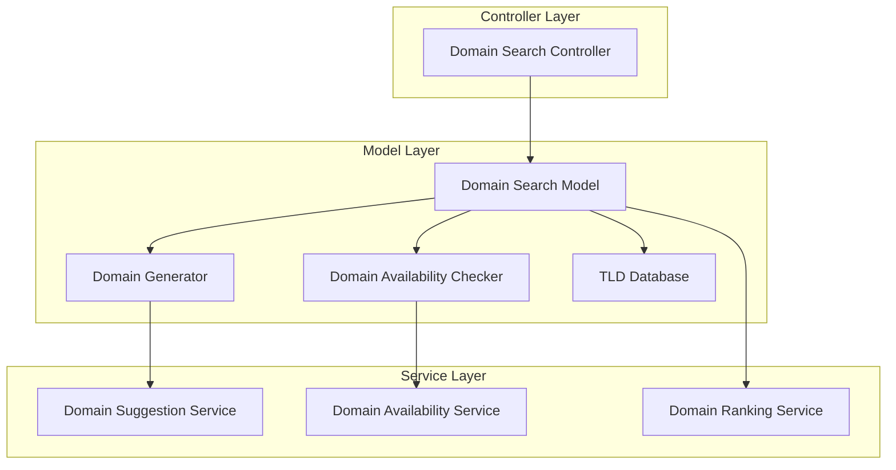

# Domain Name Search Feature

## 1. Introduction

The Domain Name Search feature is a component of the DNS MCP Server that helps users find available domain names for new projects based on specific criteria. This document details the design, implementation, and usage of this feature, focusing on creative domain name generation, keyword-based searching, and TLD filtering.

## 2. Feature Overview

Finding the perfect domain name for a new project can be challenging. This feature simplifies the process by allowing users to search for domain names based on keywords, filter by TLD characteristics, and discover creative domain hacks where the TLD forms part of the name.

### 2.1 Key Capabilities

- Search for domain names based on keywords or phrases
- Filter domains by TLD length and other criteria
- Discover creative domain hacks (e.g., "mc.cool", "artem.is")
- Check domain availability in real-time
- Sort and rank results by relevance, availability, and other factors
- Save favorite domain names for later reference

### 2.2 Use Cases

- Finding a domain name for a new project
- Brainstorming creative domain name ideas
- Checking availability of multiple domain variations
- Discovering domain hacks that incorporate the TLD
- Filtering domain options based on specific criteria

## 3. Implementation Details

### 3.1 Component Architecture



### 3.2 Class Definitions

#### 3.2.1 Domain Search Controller

```typescript
class DomainSearchController {
  constructor(
    private domainSearchModel: DomainSearchModel,
  ) {}

  async search(params: {
    keywords: string[];
    maxTldLength?: number;
    includeDomainHacks?: boolean;
    maxResults?: number;
    excludeTlds?: string[];
    includeTlds?: string[];
    maxDomainLength?: number;
    checkAvailability?: boolean;
  }): Promise<DomainSearchResult> {
    // Process request
    // Return formatted result
  }

  async getDomainHacks(params: {
    word: string;
    maxResults?: number;
    checkAvailability?: boolean;
  }): Promise<DomainHackResult> {
    // Process request
    // Return formatted result
  }
}
```

#### 3.2.2 Domain Search Model

```typescript
class DomainSearchModel {
  constructor(
    private domainGenerator: DomainGenerator,
    private availabilityChecker: DomainAvailabilityChecker,
    private tldDatabase: TLDDatabase,
  ) {}

  async search(options: DomainSearchOptions): Promise<DomainSearchResult> {
    // Generate domain suggestions
    // Check availability if requested
    // Rank and sort results
    // Return result
  }

  async findDomainHacks(word: string, options: DomainHackOptions): Promise<DomainHackResult> {
    // Find potential domain hacks
    // Check availability if requested
    // Rank and sort results
    // Return result
  }
}
```

#### 3.2.3 Domain Generator

```typescript
class DomainGenerator {
  constructor(
    private tldDatabase: TLDDatabase,
  ) {}

  generateFromKeywords(keywords: string[], options: GeneratorOptions): DomainSuggestion[] {
    // Generate domain suggestions from keywords
  }

  generateDomainHacks(word: string, options: DomainHackOptions): DomainHackSuggestion[] {
    // Generate domain hack suggestions
  }

  private combineKeywords(keywords: string[]): string[] {
    // Combine keywords in different ways
  }

  private applyTransformations(base: string): string[] {
    // Apply transformations like removing vowels, adding prefixes/suffixes
  }
}
```

#### 3.2.4 TLD Database

```typescript
class TLDDatabase {
  private tlds: TLDInfo[];

  constructor() {
    // Initialize TLD database
  }

  getAllTlds(): TLDInfo[] {
    // Return all TLDs
  }

  filterTlds(options: TLDFilterOptions): TLDInfo[] {
    // Filter TLDs by criteria
  }

  findTldsByPattern(pattern: string): TLDInfo[] {
    // Find TLDs matching a pattern
  }

  getTldsByLength(maxLength: number): TLDInfo[] {
    // Get TLDs with length <= maxLength
  }
}

interface TLDInfo {
  tld: string;
  category: 'generic' | 'country' | 'sponsored' | 'infrastructure';
  restrictions?: string;
  price?: {
    registration: number;
    renewal: number;
    currency: string;
  };
  popularity?: number;
}
```

### 3.3 Data Structures

#### 3.3.1 Domain Search Options

```typescript
interface DomainSearchOptions {
  keywords: string[];
  maxTldLength?: number;
  includeDomainHacks?: boolean;
  maxResults?: number;
  excludeTlds?: string[];
  includeTlds?: string[];
  maxDomainLength?: number;
  checkAvailability?: boolean;
  sortBy?: 'relevance' | 'length' | 'availability' | 'price';
  sortOrder?: 'asc' | 'desc';
}
```

#### 3.3.2 Domain Search Result

```typescript
interface DomainSearchResult {
  query: {
    keywords: string[];
    options: DomainSearchOptions;
  };
  results: DomainSuggestion[];
  domainHacks?: DomainHackSuggestion[];
  stats: {
    totalResults: number;
    availableResults: number;
    unavailableResults: number;
    notChecked: number;
  };
}

interface DomainSuggestion {
  domain: string;
  tld: string;
  sld: string; // Second-level domain
  available?: boolean;
  price?: {
    registration: number;
    renewal: number;
    currency: string;
  };
  relevance: number; // 0-100 score
  isDomainHack: boolean;
}
```

#### 3.3.3 Domain Hack Options and Result

```typescript
interface DomainHackOptions {
  maxResults?: number;
  checkAvailability?: boolean;
  excludeTlds?: string[];
}

interface DomainHackResult {
  word: string;
  results: DomainHackSuggestion[];
  stats: {
    totalResults: number;
    availableResults: number;
    unavailableResults: number;
    notChecked: number;
  };
}

interface DomainHackSuggestion {
  domain: string;
  tld: string;
  sld: string;
  available?: boolean;
  price?: {
    registration: number;
    renewal: number;
    currency: string;
  };
  matchQuality: number; // 0-100 score
  wordCompletion: string; // How the word is completed with the TLD
}
```

### 3.4 Domain Hack Generation

The domain hack generation algorithm will:

1. Analyze the input word or phrase
2. Find TLDs that could form part of the word
3. Generate domain hack suggestions
4. Rank suggestions by match quality

Example for the word "artemis":
- artem.is (using .is TLD)
- art.emis (not valid as .emis is not a TLD)
- arte.mis (not valid as .mis is not a TLD)

Example for "andrew":
- and.rew (not valid as .rew is not a TLD)
- andr.ew (using .ew TLD if it exists)

Example for "hopper":
- hop.per (not valid as .per is not a TLD)
- hopp.er (using .er TLD if it exists)

Example for "cool":
- co.ol (not valid as .ol is not a TLD)
- c.ool (not valid as .ool is not a TLD)

### 3.5 Keyword-Based Domain Generation

The keyword-based domain generation will:

1. Process input keywords (e.g., "andrew", "hopper", "ai")
2. Generate combinations and variations
3. Apply transformations (removing vowels, adding prefixes/suffixes)
4. Check against available TLDs
5. Rank by relevance and other criteria

Examples for keywords "andrew hopper ai":
- andrewhopper.ai
- hopper-andrew.ai
- andrew-ai.com
- hopperai.com
- ahopper.ai
- andrewhopperai.com

## 4. API Specification

### 4.1 MCP Tool Definition

```javascript
const domainSearchTool = {
  name: 'domain_search',
  description: 'Search for domain names based on keywords and criteria',
  inputSchema: {
    type: 'object',
    properties: {
      keywords: {
        type: 'array',
        items: { type: 'string' },
        description: 'Keywords to use for domain generation'
      },
      maxTldLength: {
        type: 'number',
        description: 'Maximum length of TLD to consider'
      },
      includeDomainHacks: {
        type: 'boolean',
        description: 'Whether to include domain hacks in results',
        default: true
      },
      maxResults: {
        type: 'number',
        description: 'Maximum number of results to return',
        default: 50
      },
      excludeTlds: {
        type: 'array',
        items: { type: 'string' },
        description: 'TLDs to exclude from results'
      },
      includeTlds: {
        type: 'array',
        items: { type: 'string' },
        description: 'Only include these TLDs in results'
      },
      maxDomainLength: {
        type: 'number',
        description: 'Maximum total domain length'
      },
      checkAvailability: {
        type: 'boolean',
        description: 'Whether to check domain availability',
        default: true
      },
      sortBy: {
        type: 'string',
        enum: ['relevance', 'length', 'availability', 'price'],
        description: 'How to sort results',
        default: 'relevance'
      }
    },
    required: ['keywords']
  },
  outputSchema: {
    type: 'object',
    properties: {
      query: {
        type: 'object',
        properties: {
          keywords: { type: 'array', items: { type: 'string' } },
          options: { type: 'object' }
        }
      },
      results: {
        type: 'array',
        items: {
          type: 'object',
          properties: {
            domain: { type: 'string' },
            tld: { type: 'string' },
            sld: { type: 'string' },
            available: { type: 'boolean' },
            price: {
              type: 'object',
              properties: {
                registration: { type: 'number' },
                renewal: { type: 'number' },
                currency: { type: 'string' }
              }
            },
            relevance: { type: 'number' },
            isDomainHack: { type: 'boolean' }
          }
        }
      },
      domainHacks: {
        type: 'array',
        items: {
          type: 'object',
          properties: {
            domain: { type: 'string' },
            tld: { type: 'string' },
            sld: { type: 'string' },
            available: { type: 'boolean' },
            price: {
              type: 'object',
              properties: {
                registration: { type: 'number' },
                renewal: { type: 'number' },
                currency: { type: 'string' }
              }
            },
            matchQuality: { type: 'number' },
            wordCompletion: { type: 'string' }
          }
        }
      },
      stats: {
        type: 'object',
        properties: {
          totalResults: { type: 'number' },
          availableResults: { type: 'number' },
          unavailableResults: { type: 'number' },
          notChecked: { type: 'number' }
        }
      }
    }
  },
  handler: async (params) => {
    const controller = new DomainSearchController(/* dependencies */);
    return controller.search(params);
  }
};
```

### 4.2 Domain Hack Tool Definition

```javascript
const domainHackTool = {
  name: 'domain_hack',
  description: 'Find domain hacks for a word or phrase',
  inputSchema: {
    type: 'object',
    properties: {
      word: {
        type: 'string',
        description: 'Word or phrase to find domain hacks for'
      },
      maxResults: {
        type: 'number',
        description: 'Maximum number of results to return',
        default: 20
      },
      checkAvailability: {
        type: 'boolean',
        description: 'Whether to check domain availability',
        default: true
      },
      excludeTlds: {
        type: 'array',
        items: { type: 'string' },
        description: 'TLDs to exclude from results'
      }
    },
    required: ['word']
  },
  outputSchema: {
    type: 'object',
    properties: {
      word: { type: 'string' },
      results: {
        type: 'array',
        items: {
          type: 'object',
          properties: {
            domain: { type: 'string' },
            tld: { type: 'string' },
            sld: { type: 'string' },
            available: { type: 'boolean' },
            price: {
              type: 'object',
              properties: {
                registration: { type: 'number' },
                renewal: { type: 'number' },
                currency: { type: 'string' }
              }
            },
            matchQuality: { type: 'number' },
            wordCompletion: { type: 'string' }
          }
        }
      },
      stats: {
        type: 'object',
        properties: {
          totalResults: { type: 'number' },
          availableResults: { type: 'number' },
          unavailableResults: { type: 'number' },
          notChecked: { type: 'number' }
        }
      }
    }
  },
  handler: async (params) => {
    const controller = new DomainSearchController(/* dependencies */);
    return controller.getDomainHacks(params);
  }
};
```

### 4.3 Example Requests and Responses

#### 4.3.1 Domain Search Request

```json
{
  "keywords": ["andrew", "hopper", "ai"],
  "maxTldLength": 3,
  "includeDomainHacks": true,
  "maxResults": 20,
  "checkAvailability": true
}
```

#### 4.3.2 Domain Search Response

```json
{
  "query": {
    "keywords": ["andrew", "hopper", "ai"],
    "options": {
      "maxTldLength": 3,
      "includeDomainHacks": true,
      "maxResults": 20,
      "checkAvailability": true
    }
  },
  "results": [
    {
      "domain": "andrewhopper.ai",
      "tld": "ai",
      "sld": "andrewhopper",
      "available": false,
      "price": {
        "registration": 79.99,
        "renewal": 79.99,
        "currency": "USD"
      },
      "relevance": 95,
      "isDomainHack": false
    },
    {
      "domain": "hopperai.com",
      "tld": "com",
      "sld": "hopperai",
      "available": true,
      "price": {
        "registration": 12.99,
        "renewal": 14.99,
        "currency": "USD"
      },
      "relevance": 90,
      "isDomainHack": false
    },
    {
      "domain": "andrewhopperai.com",
      "tld": "com",
      "sld": "andrewhopperai",
      "available": true,
      "price": {
        "registration": 12.99,
        "renewal": 14.99,
        "currency": "USD"
      },
      "relevance": 85,
      "isDomainHack": false
    }
  ],
  "domainHacks": [
    {
      "domain": "andrewhop.per",
      "tld": "per",
      "sld": "andrewhop",
      "available": null,
      "matchQuality": 75,
      "wordCompletion": "andrewhop[per]"
    },
    {
      "domain": "andrewhopp.er",
      "tld": "er",
      "sld": "andrewhopp",
      "available": true,
      "price": {
        "registration": 24.99,
        "renewal": 24.99,
        "currency": "USD"
      },
      "matchQuality": 80,
      "wordCompletion": "andrewhopp[er]"
    }
  ],
  "stats": {
    "totalResults": 5,
    "availableResults": 3,
    "unavailableResults": 1,
    "notChecked": 1
  }
}
```

#### 4.3.3 Domain Hack Request

```json
{
  "word": "artemis",
  "checkAvailability": true
}
```

#### 4.3.4 Domain Hack Response

```json
{
  "word": "artemis",
  "results": [
    {
      "domain": "artem.is",
      "tld": "is",
      "sld": "artem",
      "available": true,
      "price": {
        "registration": 39.99,
        "renewal": 39.99,
        "currency": "USD"
      },
      "matchQuality": 95,
      "wordCompletion": "artem[is]"
    }
  ],
  "stats": {
    "totalResults": 1,
    "availableResults": 1,
    "unavailableResults": 0,
    "notChecked": 0
  }
}
```

## 5. TLD Database

The TLD database will contain information about all available TLDs, including:

1. TLD string (.com, .net, .org, etc.)
2. Category (generic, country, sponsored, infrastructure)
3. Restrictions (if any)
4. Pricing information
5. Popularity metrics

The database will be regularly updated to ensure accuracy.

### 5.1 TLD Categories

- **Generic TLDs**: .com, .net, .org, .info, etc.
- **Country Code TLDs**: .us, .uk, .ca, .de, etc.
- **Sponsored TLDs**: .edu, .gov, .mil, etc.
- **Infrastructure TLDs**: .arpa
- **New gTLDs**: .app, .dev, .ai, .io, etc.

### 5.2 TLD Length Distribution

| Length | Count | Examples |
|--------|-------|----------|
| 2      | ~40   | .io, .ai, .me, .co, .uk |
| 3      | ~100  | .com, .net, .org, .dev, .app |
| 4+     | ~1000+ | .info, .online, .website, .technology |

## 6. Performance Considerations

### 6.1 Response Time Targets

- Domain search: < 2000ms
- Domain hack search: < 1000ms
- With availability checking: < 5000ms

### 6.2 Optimization Strategies

1. **Caching**: Cache TLD database and popular search results
2. **Parallel Processing**: Check domain availability in parallel
3. **Lazy Loading**: Generate results incrementally
4. **Prioritization**: Check availability of high-relevance domains first
5. **Rate Limiting**: Implement client-side rate limiting for availability checks

## 7. Error Handling

### 7.1 Common Errors

| Error Code | Description | HTTP Status |
|------------|-------------|-------------|
| `INVALID_KEYWORDS` | Invalid or empty keywords | 400 |
| `TLD_NOT_FOUND` | Specified TLD not found | 404 |
| `AVAILABILITY_CHECK_FAILED` | Domain availability check failed | 502 |
| `RATE_LIMIT_EXCEEDED` | Too many requests | 429 |

### 7.2 Error Response Example

```json
{
  "error": {
    "code": "AVAILABILITY_CHECK_FAILED",
    "message": "Failed to check availability for some domains",
    "details": {
      "failedDomains": ["example.com", "example.net"],
      "reason": "Registrar API timeout"
    }
  }
}
```

## 8. Testing Strategy

### 8.1 Unit Tests

- Test domain generation algorithms
- Test TLD filtering
- Test domain hack generation
- Test result ranking and sorting

### 8.2 Integration Tests

- Test end-to-end flow with mocked availability checking
- Test performance under load
- Test error scenarios

### 8.3 Test Cases

1. Search with various keyword combinations
2. Search with TLD length restrictions
3. Search for domain hacks with various words
4. Test availability checking
5. Test sorting and ranking algorithms

## 9. Future Enhancements

1. Semantic analysis for better keyword combinations
2. Machine learning for domain name quality scoring
3. Integration with domain registration services
4. Historical domain availability tracking
5. Domain name pronunciation and memorability scoring
6. Trademark and brand name conflict detection

## 10. Dependencies

- TLD database
- Domain availability checking service
- Natural language processing libraries
- Caching library
- HTTP client for registrar APIs

## 11. Security Considerations

1. Validate and sanitize all user inputs
2. Implement rate limiting to prevent abuse
3. Secure handling of availability check results
4. Privacy considerations for user search patterns
5. Proper error handling to prevent information leakage