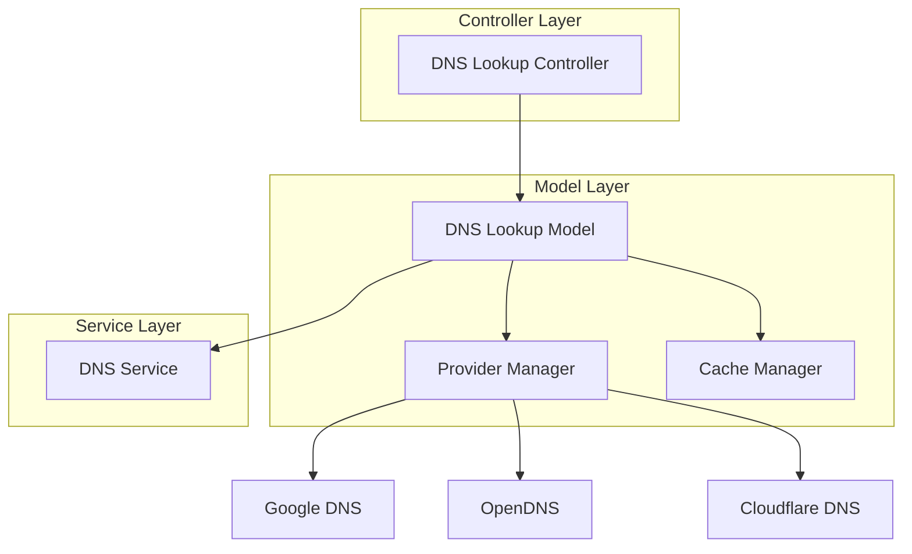

# NS Record Lookup Feature

## 1. Introduction

The NS (Name Server) record lookup feature is a core component of the DNS MCP Server, providing users with the ability to query and retrieve NS records for a specified domain. This document details the design, implementation, and usage of this feature.

## 2. Feature Overview

NS records specify the authoritative name servers for a domain. These records are crucial for understanding the DNS infrastructure of a domain and are often the first step in diagnosing DNS-related issues.

### 2.1 Key Capabilities

- Lookup NS records for any valid domain
- Retrieve TTL (Time To Live) values for each record
- Query multiple DNS providers (Google, OpenDNS, Cloudflare)
- Compare results across providers
- Optional caching of results

### 2.2 Use Cases

- Verifying DNS configuration changes
- Troubleshooting DNS propagation issues
- Auditing domain configurations
- Checking for DNS misconfigurations
- Educational purposes for understanding DNS

## 3. Implementation Details

### 3.1 Component Architecture



### 3.2 Class Definitions

#### 3.2.1 DNS Lookup Controller

```typescript
class DNSLookupController {
  constructor(
    private dnsLookupModel: DNSLookupModel,
  ) {}

  async lookupNS(params: {
    domain: string;
    provider?: 'google' | 'opendns' | 'cloudflare' | 'all';
    useCache?: boolean;
  }): Promise<NSLookupResult> {
    // Validate domain
    // Process request
    // Return formatted result
  }
}
```

#### 3.2.2 DNS Lookup Model

```typescript
class DNSLookupModel {
  constructor(
    private providerManager: ProviderManager,
    private cacheManager: CacheManager,
    private dnsService: DNSService,
  ) {}

  async lookupNS(
    domain: string,
    provider: 'google' | 'opendns' | 'cloudflare' | 'all',
    useCache: boolean
  ): Promise<NSLookupResult> {
    // Check cache if enabled
    // Determine which providers to query
    // Query each provider
    // Aggregate results
    // Update cache if enabled
    // Return result
  }
}
```

#### 3.2.3 Provider Manager

```typescript
class ProviderManager {
  private providers: Map<string, DNSProvider>;

  constructor() {
    this.providers = new Map();
    this.providers.set('google', new GoogleDNSProvider());
    this.providers.set('opendns', new OpenDNSProvider());
    this.providers.set('cloudflare', new CloudflareDNSProvider());
  }

  getProvider(name: string): DNSProvider {
    const provider = this.providers.get(name);
    if (!provider) {
      throw new Error(`Provider ${name} not found`);
    }
    return provider;
  }

  getAllProviders(): DNSProvider[] {
    return Array.from(this.providers.values());
  }
}
```

#### 3.2.4 DNS Provider Interface

```typescript
interface DNSProvider {
  name: string;
  lookupNS(domain: string): Promise<NSRecord[]>;
}

interface NSRecord {
  name: string;
  ttl: number;
  value: string;
}
```

### 3.3 Data Structures

#### 3.3.1 NS Lookup Result

```typescript
interface NSLookupResult {
  domain: string;
  recordType: 'NS';
  provider: string;
  fromCache: boolean;
  timestamp: string;
  results: ProviderResult[];
}

interface ProviderResult {
  provider: string;
  records: NSRecord[];
  responseTime?: number;
  error?: string;
}

interface NSRecord {
  name: string;
  ttl: number;
  value: string;
}
```

### 3.4 Provider Implementations

#### 3.4.1 Google DNS Provider

```typescript
class GoogleDNSProvider implements DNSProvider {
  name = 'google';

  async lookupNS(domain: string): Promise<NSRecord[]> {
    // Implementation using Google's DNS-over-HTTPS API
    // https://dns.google/resolve?name=example.com&type=NS
  }
}
```

#### 3.4.2 OpenDNS Provider

```typescript
class OpenDNSProvider implements DNSProvider {
  name = 'opendns';

  async lookupNS(domain: string): Promise<NSRecord[]> {
    // Implementation using OpenDNS API or DNS queries
  }
}
```

#### 3.4.3 Cloudflare DNS Provider

```typescript
class CloudflareDNSProvider implements DNSProvider {
  name = 'cloudflare';

  async lookupNS(domain: string): Promise<NSRecord[]> {
    // Implementation using Cloudflare's DNS-over-HTTPS API
    // https://cloudflare-dns.com/dns-query
  }
}
```

## 4. API Specification

### 4.1 MCP Tool Definition

```javascript
const nsLookupTool = {
  name: 'dns_lookup_ns',
  description: 'Look up NS records for a domain',
  inputSchema: {
    type: 'object',
    properties: {
      domain: {
        type: 'string',
        description: 'Domain name to look up'
      },
      provider: {
        type: 'string',
        enum: ['google', 'opendns', 'cloudflare', 'all'],
        description: 'DNS provider to use',
        default: 'google'
      },
      useCache: {
        type: 'boolean',
        description: 'Whether to use cached results if available',
        default: false
      }
    },
    required: ['domain']
  },
  outputSchema: {
    type: 'object',
    properties: {
      domain: { type: 'string' },
      recordType: { type: 'string', enum: ['NS'] },
      provider: { type: 'string' },
      fromCache: { type: 'boolean' },
      timestamp: { type: 'string', format: 'date-time' },
      results: {
        type: 'array',
        items: {
          type: 'object',
          properties: {
            provider: { type: 'string' },
            records: {
              type: 'array',
              items: {
                type: 'object',
                properties: {
                  name: { type: 'string' },
                  ttl: { type: 'number' },
                  value: { type: 'string' }
                }
              }
            },
            responseTime: { type: 'number' },
            error: { type: 'string' }
          }
        }
      }
    }
  },
  handler: async (params) => {
    const controller = new DNSLookupController(/* dependencies */);
    return controller.lookupNS(params);
  }
};
```

### 4.2 Example Request

```json
{
  "domain": "example.com",
  "provider": "all",
  "useCache": false
}
```

### 4.3 Example Response

```json
{
  "domain": "example.com",
  "recordType": "NS",
  "provider": "all",
  "fromCache": false,
  "timestamp": "2025-04-12T20:00:00.000Z",
  "results": [
    {
      "provider": "google",
      "responseTime": 125,
      "records": [
        {
          "name": "example.com",
          "ttl": 86400,
          "value": "a.iana-servers.net"
        },
        {
          "name": "example.com",
          "ttl": 86400,
          "value": "b.iana-servers.net"
        }
      ]
    },
    {
      "provider": "opendns",
      "responseTime": 142,
      "records": [
        {
          "name": "example.com",
          "ttl": 86400,
          "value": "a.iana-servers.net"
        },
        {
          "name": "example.com",
          "ttl": 86400,
          "value": "b.iana-servers.net"
        }
      ]
    },
    {
      "provider": "cloudflare",
      "responseTime": 98,
      "records": [
        {
          "name": "example.com",
          "ttl": 86400,
          "value": "a.iana-servers.net"
        },
        {
          "name": "example.com",
          "ttl": 86400,
          "value": "b.iana-servers.net"
        }
      ]
    }
  ]
}
```

## 5. Error Handling

### 5.1 Common Errors

| Error Code | Description | HTTP Status |
|------------|-------------|-------------|
| `INVALID_DOMAIN` | Domain name is invalid | 400 |
| `DOMAIN_NOT_FOUND` | Domain does not exist | 404 |
| `PROVIDER_ERROR` | DNS provider returned an error | 502 |
| `TIMEOUT` | Request to DNS provider timed out | 504 |
| `RATE_LIMIT_EXCEEDED` | Too many requests to DNS provider | 429 |

### 5.2 Error Response Example

```json
{
  "error": {
    "code": "DOMAIN_NOT_FOUND",
    "message": "The domain 'nonexistent-domain.com' does not exist",
    "details": {
      "domain": "nonexistent-domain.com"
    }
  }
}
```

### 5.3 Error Handling Strategy

1. Validate input parameters before making DNS queries
2. Implement timeouts for DNS provider requests
3. Handle provider-specific errors and translate to standard error codes
4. Log detailed error information for debugging
5. Return user-friendly error messages

## 6. Performance Considerations

### 6.1 Response Time Targets

- P50 response time: < 200ms
- P95 response time: < 500ms
- P99 response time: < 1000ms

### 6.2 Optimization Strategies

1. **Parallel Queries**: When querying multiple providers, make requests in parallel
2. **Connection Pooling**: Maintain persistent connections to DNS providers
3. **Caching**: Implement optional caching with appropriate TTL values
4. **Timeout Management**: Set appropriate timeouts for DNS queries
5. **Rate Limiting**: Implement client-side rate limiting to avoid provider throttling

### 6.3 Caching Strategy

- Cache results based on domain and record type
- Respect TTL values from DNS responses
- Allow users to bypass cache with `useCache: false`
- Implement cache invalidation for stale entries

## 7. Testing Strategy

### 7.1 Unit Tests

- Test DNS lookup controller with mocked dependencies
- Test provider implementations with mocked HTTP responses
- Test cache manager functionality
- Test error handling scenarios

### 7.2 Integration Tests

- Test end-to-end flow with real DNS providers
- Test caching behavior
- Test performance under load
- Test error scenarios with real providers

### 7.3 Test Cases

1. Lookup NS records for valid domains
2. Lookup NS records for non-existent domains
3. Compare results across multiple providers
4. Verify caching behavior
5. Test error handling for various scenarios
6. Test performance with multiple concurrent requests

## 8. Future Enhancements

1. Support for additional record types (A, AAAA, MX)
2. Historical record tracking
3. DNS propagation monitoring
4. Advanced filtering and sorting options
5. Export results in different formats (CSV, JSON, etc.)
6. Integration with domain registration services

## 9. Dependencies

- DNS-over-HTTPS APIs for providers
- HTTP client library
- Caching library
- Validation library
- Logging framework

## 10. Security Considerations

1. Validate and sanitize all user inputs
2. Implement rate limiting to prevent abuse
3. Handle sensitive information securely
4. Use HTTPS for all external API calls
5. Implement proper error handling to prevent information leakage