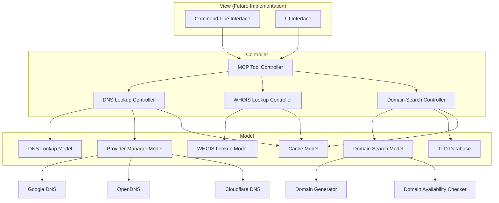

# DNS MCP Server Overview

## 1. Introduction

The DNS MCP Server is a specialized Model Context Protocol (MCP) server designed to help users troubleshoot DNS configurations directly within their Integrated Development Environment (IDE). By leveraging the fastmcp framework, this server provides tools for DNS lookups, WHOIS information retrieval, and DNS record verification across multiple DNS providers.

## 2. Project Goals

- Provide developers with quick access to DNS information without leaving their IDE
- Simplify the process of troubleshooting DNS configuration issues
- Enable comparison of DNS records across different providers (Google, OpenDNS, Cloudflare)
- Offer both command-line and UI interfaces for different user preferences
- Implement an extensible architecture that can accommodate future features

## 3. Architecture Overview

The DNS MCP Server follows the Model-View-Controller (MVC) pattern to ensure a clean separation of concerns and facilitate future extensions:

### 3.1 MVC Components

### 3.2 Component Descriptions

#### Models
- **DNS Lookup Model**: Handles the core DNS lookup functionality
- **WHOIS Lookup Model**: Manages WHOIS information retrieval
- **Provider Manager Model**: Coordinates access to different DNS providers
- **Domain Search Model**: Handles domain name searching and generation
- **Cache Model**: Implements optional caching for improved performance
- **TLD Database**: Manages information about top-level domains

#### Controllers
- **DNS Lookup Controller**: Processes DNS lookup requests
- **WHOIS Lookup Controller**: Processes WHOIS lookup requests
- **Domain Search Controller**: Processes domain search and domain hack requests
- **MCP Tool Controller**: Routes MCP tool requests to appropriate controllers

#### Views (Future Implementation)
- **Command Line Interface**: Provides command-line access to DNS tools
- **UI Interface**: Offers a graphical interface for DNS tools

## 4. Implementation Phases

The implementation will follow a phased approach:

### Phase 1: Core Functionality
- Implement the Model and Controller layers
- Develop NS record lookup functionality
- Implement WHOIS lookup with minimal information
- Integrate with Google, OpenDNS, and Cloudflare
- Implement optional caching

### Phase 2: Domain Search Functionality
- Develop TLD database
- Implement domain name generation algorithms
- Create domain hack detection and generation
- Implement keyword-based domain suggestion
- Integrate with domain availability checking

### Phase 3: User Interface
- Develop command-line interface
- Create UI components for IDE integration
- Implement user preferences and settings

### Phase 4: Extended Features
- Add support for A, AAAA, and MX records
- Implement domain purchase functionality
- Add email configuration verification
- Develop DKIM, SPF verification tools

## 5. Integration with IDE

The DNS MCP Server will integrate with IDEs through the Model Context Protocol, providing:

- Tool registration with the IDE
- Command processing
- Result formatting for IDE display
- Future UI panel integration

## 6. Key Features

### Initial Features
- NS record lookup with TTL information
- WHOIS lookup (registrar, dates, nameservers)
- Multiple DNS provider support
- Domain name search and domain hack generation
- Optional result caching

### Future Features
- Additional record type support (A, AAAA, MX)
- Domain availability checking
- Domain search and purchase
- Email configuration verification
- DKIM, SPF verification

## 7. Target Users

- Web developers
- DevOps engineers
- System administrators
- Network engineers
- Anyone working with DNS configurations

## 8. Success Criteria

- Accurate DNS information retrieval
- Fast response times
- Intuitive user interface
- Extensible architecture
- Reliable caching mechanism
- Comprehensive error handling