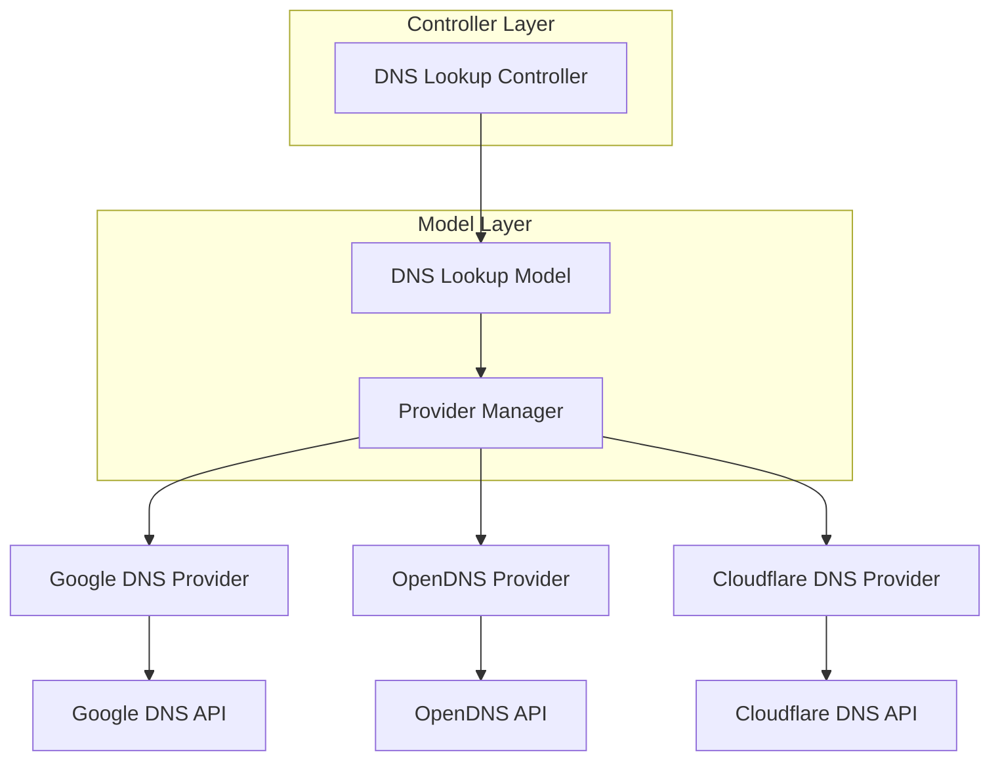

# DNS Provider Integration

## 1. Introduction

The DNS Provider Integration component is a critical part of the DNS MCP Server, enabling the system to query multiple DNS providers and compare results. This document details the design, implementation, and usage of this feature, focusing on integration with Google DNS, OpenDNS, and Cloudflare DNS.

## 2. Feature Overview

DNS providers are the services that resolve domain names to IP addresses and provide other DNS record information. Different providers may have slightly different data or propagation times, making it valuable to compare results across providers when troubleshooting DNS issues.

### 2.1 Key Capabilities

- Query multiple DNS providers (Google, OpenDNS, Cloudflare)
- Default to a single provider for quick lookups
- Compare results across all providers when needed
- Handle provider-specific error conditions
- Track response times for performance comparison

### 2.2 Use Cases

- Verifying DNS propagation across providers
- Identifying inconsistencies in DNS records
- Troubleshooting DNS resolution issues
- Comparing performance of different DNS providers
- Detecting DNS poisoning or other security issues

## 3. Implementation Details

### 3.1 Component Architecture



### 3.2 Provider Manager

The Provider Manager is responsible for:
- Maintaining the registry of available DNS providers
- Selecting the appropriate provider(s) based on user request
- Handling provider-specific configuration
- Managing provider connections and rate limiting

```typescript
class ProviderManager {
  private providers: Map<string, DNSProvider>;
  private defaultProvider: string;

  constructor(config: ProviderManagerConfig) {
    this.providers = new Map();
    this.defaultProvider = config.defaultProvider || 'google';
    
    // Initialize providers
    this.registerProvider('google', new GoogleDNSProvider(config.google));
    this.registerProvider('opendns', new OpenDNSProvider(config.opendns));
    this.registerProvider('cloudflare', new CloudflareDNSProvider(config.cloudflare));
  }

  registerProvider(name: string, provider: DNSProvider): void {
    this.providers.set(name, provider);
  }

  getProvider(name: string): DNSProvider {
    const provider = this.providers.get(name);
    if (!provider) {
      throw new Error(`Provider ${name} not found`);
    }
    return provider;
  }

  getDefaultProvider(): DNSProvider {
    return this.getProvider(this.defaultProvider);
  }

  getAllProviders(): DNSProvider[] {
    return Array.from(this.providers.values());
  }

  async queryProvider(
    provider: string | 'all',
    queryType: 'NS',
    domain: string
  ): Promise<ProviderResult | ProviderResult[]> {
    if (provider === 'all') {
      return this.queryAllProviders(queryType, domain);
    }
    
    const dnsProvider = this.getProvider(provider);
    const startTime = Date.now();
    
    try {
      const records = await dnsProvider.lookup(queryType, domain);
      const responseTime = Date.now() - startTime;
      
      return {
        provider: dnsProvider.name,
        records,
        responseTime
      };
    } catch (error) {
      return {
        provider: dnsProvider.name,
        records: [],
        error: error.message
      };
    }
  }

  private async queryAllProviders(
    queryType: 'NS',
    domain: string
  ): Promise<ProviderResult[]> {
    const providers = this.getAllProviders();
    const queries = providers.map(provider => 
      this.queryProvider(provider.name, queryType, domain)
    );
    
    // Execute all queries in parallel
    const results = await Promise.all(queries);
    return results as ProviderResult[];
  }
}
```

### 3.3 DNS Provider Interface

All DNS providers implement a common interface to ensure consistent behavior:

```typescript
interface DNSProvider {
  name: string;
  lookup(recordType: 'NS', domain: string): Promise<DNSRecord[]>;
  isAvailable(): Promise<boolean>;
  getCapabilities(): ProviderCapabilities;
}

interface ProviderCapabilities {
  supportedRecordTypes: string[];
  supportsDoH: boolean; // DNS over HTTPS
  supportsDNSSEC: boolean;
  rateLimit?: {
    requestsPerMinute: number;
    requestsPerDay: number;
  };
}

interface DNSRecord {
  name: string;
  ttl: number;
  value: string;
}

interface ProviderResult {
  provider: string;
  records: DNSRecord[];
  responseTime?: number;
  error?: string;
}
```

### 3.4 Provider Implementations

#### 3.4.1 Google DNS Provider

Google DNS provides a reliable DNS service with DNS-over-HTTPS capabilities.

```typescript
class GoogleDNSProvider implements DNSProvider {
  name = 'google';
  private baseUrl = 'https://dns.google/resolve';
  private apiKey?: string;

  constructor(config?: GoogleDNSConfig) {
    this.apiKey = config?.apiKey;
  }

  async lookup(recordType: 'NS', domain: string): Promise<DNSRecord[]> {
    const url = new URL(this.baseUrl);
    url.searchParams.append('name', domain);
    url.searchParams.append('type', recordType);
    
    if (this.apiKey) {
      url.searchParams.append('key', this.apiKey);
    }
    
    const response = await fetch(url.toString(), {
      headers: {
        'Accept': 'application/dns-json'
      }
    });
    
    if (!response.ok) {
      throw new Error(`Google DNS error: ${response.status} ${response.statusText}`);
    }
    
    const data = await response.json();
    
    if (data.Status !== 0) {
      throw new Error(`DNS error: ${this.getDNSErrorMessage(data.Status)}`);
    }
    
    return this.parseGoogleDNSResponse(data, recordType);
  }

  isAvailable(): Promise<boolean> {
    return fetch('https://dns.google/resolve?name=google.com&type=A')
      .then(response => response.ok)
      .catch(() => false);
  }

  getCapabilities(): ProviderCapabilities {
    return {
      supportedRecordTypes: ['A', 'AAAA', 'CNAME', 'MX', 'NS', 'TXT', 'SOA', 'SRV', 'PTR'],
      supportsDoH: true,
      supportsDNSSEC: true,
      rateLimit: {
        requestsPerMinute: 60,
        requestsPerDay: 10000
      }
    };
  }

  private parseGoogleDNSResponse(data: any, recordType: string): DNSRecord[] {
    if (!data.Answer) {
      return [];
    }
    
    return data.Answer.map((answer: any) => ({
      name: answer.name,
      ttl: answer.TTL,
      value: answer.data
    }));
  }

  private getDNSErrorMessage(status: number): string {
    const errorMessages: Record<number, string> = {
      1: 'Format error',
      2: 'Server failure',
      3: 'Name error (domain does not exist)',
      4: 'Not implemented',
      5: 'Refused'
    };
    
    return errorMessages[status] || `Unknown error (${status})`;
  }
}
```

#### 3.4.2 OpenDNS Provider

OpenDNS is a popular DNS service with additional security features.

```typescript
class OpenDNSProvider implements DNSProvider {
  name = 'opendns';
  private baseUrl = 'https://doh.opendns.com/dns-query';
  private apiKey?: string;

  constructor(config?: OpenDNSConfig) {
    this.apiKey = config?.apiKey;
  }

  async lookup(recordType: 'NS', domain: string): Promise<DNSRecord[]> {
    // Implementation similar to Google DNS but using OpenDNS API
    // OpenDNS uses a slightly different API format
    
    const url = new URL(this.baseUrl);
    url.searchParams.append('name', domain);
    url.searchParams.append('type', recordType);
    
    const response = await fetch(url.toString(), {
      headers: {
        'Accept': 'application/dns-json'
      }
    });
    
    if (!response.ok) {
      throw new Error(`OpenDNS error: ${response.status} ${response.statusText}`);
    }
    
    const data = await response.json();
    return this.parseOpenDNSResponse(data, recordType);
  }

  isAvailable(): Promise<boolean> {
    return fetch('https://doh.opendns.com/dns-query?name=opendns.com&type=A', {
      headers: { 'Accept': 'application/dns-json' }
    })
      .then(response => response.ok)
      .catch(() => false);
  }

  getCapabilities(): ProviderCapabilities {
    return {
      supportedRecordTypes: ['A', 'AAAA', 'CNAME', 'MX', 'NS', 'TXT', 'SOA', 'SRV', 'PTR'],
      supportsDoH: true,
      supportsDNSSEC: true,
      rateLimit: {
        requestsPerMinute: 30,
        requestsPerDay: 5000
      }
    };
  }

  private parseOpenDNSResponse(data: any, recordType: string): DNSRecord[] {
    // Parse OpenDNS response format
    // Similar to Google DNS but with potential differences
    
    if (!data.Answer) {
      return [];
    }
    
    return data.Answer.map((answer: any) => ({
      name: answer.name,
      ttl: answer.TTL,
      value: answer.data
    }));
  }
}
```

#### 3.4.3 Cloudflare DNS Provider

Cloudflare DNS is known for its performance and privacy features.

```typescript
class CloudflareDNSProvider implements DNSProvider {
  name = 'cloudflare';
  private baseUrl = 'https://cloudflare-dns.com/dns-query';
  private apiKey?: string;

  constructor(config?: CloudflareDNSConfig) {
    this.apiKey = config?.apiKey;
  }

  async lookup(recordType: 'NS', domain: string): Promise<DNSRecord[]> {
    const url = new URL(this.baseUrl);
    url.searchParams.append('name', domain);
    url.searchParams.append('type', recordType);
    
    const headers: HeadersInit = {
      'Accept': 'application/dns-json'
    };
    
    if (this.apiKey) {
      headers['Authorization'] = `Bearer ${this.apiKey}`;
    }
    
    const response = await fetch(url.toString(), { headers });
    
    if (!response.ok) {
      throw new Error(`Cloudflare DNS error: ${response.status} ${response.statusText}`);
    }
    
    const data = await response.json();
    return this.parseCloudflareResponse(data, recordType);
  }

  isAvailable(): Promise<boolean> {
    return fetch('https://cloudflare-dns.com/dns-query?name=cloudflare.com&type=A', {
      headers: { 'Accept': 'application/dns-json' }
    })
      .then(response => response.ok)
      .catch(() => false);
  }

  getCapabilities(): ProviderCapabilities {
    return {
      supportedRecordTypes: ['A', 'AAAA', 'CNAME', 'MX', 'NS', 'TXT', 'SOA', 'SRV', 'PTR', 'CAA'],
      supportsDoH: true,
      supportsDNSSEC: true,
      rateLimit: {
        requestsPerMinute: 100,
        requestsPerDay: 100000
      }
    };
  }

  private parseCloudflareResponse(data: any, recordType: string): DNSRecord[] {
    if (!data.Answer) {
      return [];
    }
    
    return data.Answer.map((answer: any) => ({
      name: answer.name,
      ttl: answer.TTL,
      value: answer.data
    }));
  }
}
```

## 4. Provider Configuration

### 4.1 Default Configuration

The system will use the following default configuration:

```javascript
const defaultProviderConfig = {
  defaultProvider: 'google',
  google: {
    apiKey: process.env.GOOGLE_DNS_API_KEY
  },
  opendns: {
    apiKey: process.env.OPENDNS_API_KEY
  },
  cloudflare: {
    apiKey: process.env.CLOUDFLARE_API_KEY
  }
};
```

### 4.2 User Configuration

Users can override the default provider in their requests:

```javascript
// Example request specifying a provider
{
  "domain": "example.com",
  "provider": "cloudflare",
  "useCache": false
}
```

### 4.3 Provider Selection Logic

1. If user specifies a provider, use that provider
2. If user specifies 'all', query all available providers
3. If no provider specified, use the default provider
4. If the selected provider is unavailable, fall back to the default provider

## 5. Result Comparison

When comparing results across providers, the system will:

1. Execute queries to all providers in parallel
2. Collect and format results from each provider
3. Identify any discrepancies in the records
4. Highlight differences in TTL values
5. Report response times for performance comparison

### 5.1 Comparison Example

```json
{
  "domain": "example.com",
  "recordType": "NS",
  "provider": "all",
  "fromCache": false,
  "timestamp": "2025-04-12T20:00:00.000Z",
  "results": [
    {
      "provider": "google",
      "responseTime": 125,
      "records": [
        {
          "name": "example.com",
          "ttl": 86400,
          "value": "a.iana-servers.net"
        },
        {
          "name": "example.com",
          "ttl": 86400,
          "value": "b.iana-servers.net"
        }
      ]
    },
    {
      "provider": "opendns",
      "responseTime": 142,
      "records": [
        {
          "name": "example.com",
          "ttl": 86400,
          "value": "a.iana-servers.net"
        },
        {
          "name": "example.com",
          "ttl": 86400,
          "value": "b.iana-servers.net"
        }
      ]
    },
    {
      "provider": "cloudflare",
      "responseTime": 98,
      "records": [
        {
          "name": "example.com",
          "ttl": 86400,
          "value": "a.iana-servers.net"
        },
        {
          "name": "example.com",
          "ttl": 86400,
          "value": "b.iana-servers.net"
        }
      ]
    }
  ],
  "comparison": {
    "identical": true,
    "differences": [],
    "fastestProvider": "cloudflare",
    "slowestProvider": "opendns"
  }
}
```

### 5.2 Comparison with Differences

```json
{
  "domain": "newdomain.com",
  "recordType": "NS",
  "provider": "all",
  "fromCache": false,
  "timestamp": "2025-04-12T20:00:00.000Z",
  "results": [
    {
      "provider": "google",
      "responseTime": 130,
      "records": [
        {
          "name": "newdomain.com",
          "ttl": 3600,
          "value": "ns1.newhost.com"
        },
        {
          "name": "newdomain.com",
          "ttl": 3600,
          "value": "ns2.newhost.com"
        }
      ]
    },
    {
      "provider": "opendns",
      "responseTime": 145,
      "records": [
        {
          "name": "newdomain.com",
          "ttl": 3600,
          "value": "ns1.oldhost.com"
        },
        {
          "name": "newdomain.com",
          "ttl": 3600,
          "value": "ns2.oldhost.com"
        }
      ]
    },
    {
      "provider": "cloudflare",
      "responseTime": 95,
      "records": [
        {
          "name": "newdomain.com",
          "ttl": 3600,
          "value": "ns1.newhost.com"
        },
        {
          "name": "newdomain.com",
          "ttl": 3600,
          "value": "ns2.newhost.com"
        }
      ]
    }
  ],
  "comparison": {
    "identical": false,
    "differences": [
      {
        "type": "value",
        "field": "value",
        "providers": {
          "google": "ns1.newhost.com",
          "opendns": "ns1.oldhost.com",
          "cloudflare": "ns1.newhost.com"
        },
        "note": "OpenDNS has different nameservers, possibly due to propagation delay"
      }
    ],
    "fastestProvider": "cloudflare",
    "slowestProvider": "opendns"
  }
}
```

## 6. Error Handling

### 6.1 Provider-specific Errors

Each provider may return different error codes and messages. The Provider Manager will normalize these errors into standard formats:

| Provider Error | Normalized Error Code | Description |
|----------------|------------------------|-------------|
| Google DNS NXDOMAIN | `DOMAIN_NOT_FOUND` | Domain does not exist |
| OpenDNS Server Error | `PROVIDER_ERROR` | Provider server error |
| Cloudflare Rate Limit | `RATE_LIMIT_EXCEEDED` | Too many requests |
| Any Provider Timeout | `TIMEOUT` | Request timed out |

### 6.2 Fallback Mechanism

If a specific provider fails, the system will:

1. Log the error
2. Include the error in the result for that provider
3. Continue with other providers if querying multiple providers
4. Fall back to the default provider if the requested provider fails

### 6.3 Error Response Example

```json
{
  "domain": "example.com",
  "recordType": "NS",
  "provider": "all",
  "fromCache": false,
  "timestamp": "2025-04-12T20:00:00.000Z",
  "results": [
    {
      "provider": "google",
      "responseTime": 125,
      "records": [
        {
          "name": "example.com",
          "ttl": 86400,
          "value": "a.iana-servers.net"
        },
        {
          "name": "example.com",
          "ttl": 86400,
          "value": "b.iana-servers.net"
        }
      ]
    },
    {
      "provider": "opendns",
      "error": "Request timed out after 3000ms",
      "records": []
    },
    {
      "provider": "cloudflare",
      "responseTime": 98,
      "records": [
        {
          "name": "example.com",
          "ttl": 86400,
          "value": "a.iana-servers.net"
        },
        {
          "name": "example.com",
          "ttl": 86400,
          "value": "b.iana-servers.net"
        }
      ]
    }
  ],
  "comparison": {
    "identical": true,
    "differences": [],
    "fastestProvider": "cloudflare",
    "errors": [
      {
        "provider": "opendns",
        "error": "Request timed out after 3000ms"
      }
    ]
  }
}
```

## 7. Performance Considerations

### 7.1 Response Time Targets

- Single provider query: < 200ms
- All providers query: < 500ms
- P95 response time: < 1000ms

### 7.2 Optimization Strategies

1. **Parallel Queries**: Execute queries to all providers in parallel
2. **Connection Pooling**: Maintain persistent connections to DNS providers
3. **Timeout Management**: Set appropriate timeouts for each provider
4. **Rate Limiting**: Implement client-side rate limiting to avoid provider throttling
5. **Provider Health Checks**: Periodically check provider availability

### 7.3 Rate Limiting

To avoid hitting provider rate limits, the system will:

1. Track request counts per provider
2. Implement exponential backoff for retries
3. Distribute requests across providers when possible
4. Cache results to reduce the number of requests

## 8. Testing Strategy

### 8.1 Unit Tests

- Test Provider Manager with mocked providers
- Test individual provider implementations with mocked HTTP responses
- Test error handling and fallback mechanisms
- Test result comparison logic

### 8.2 Integration Tests

- Test end-to-end flow with real DNS providers
- Test performance under load
- Test error scenarios with real providers
- Test provider failover and recovery

### 8.3 Test Cases

1. Query each provider individually
2. Query all providers simultaneously
3. Test with valid and invalid domains
4. Test with recently updated domains to check for propagation differences
5. Test provider failover when primary provider is unavailable
6. Test rate limiting behavior

## 9. Future Enhancements

1. Add support for additional DNS providers
2. Implement provider scoring based on reliability and performance
3. Add geographic distribution of queries for global DNS testing
4. Implement advanced comparison algorithms for complex record types
5. Add historical tracking of provider performance
6. Support for custom DNS servers specified by the user

## 10. Dependencies

- HTTP client library for API requests
- DNS resolution library
- Validation library
- Logging framework
- Rate limiting library

## 11. Security Considerations

1. Validate and sanitize all user inputs
2. Use HTTPS for all provider API calls
3. Handle API keys securely
4. Implement proper error handling to prevent information leakage
5. Respect provider terms of service and rate limits