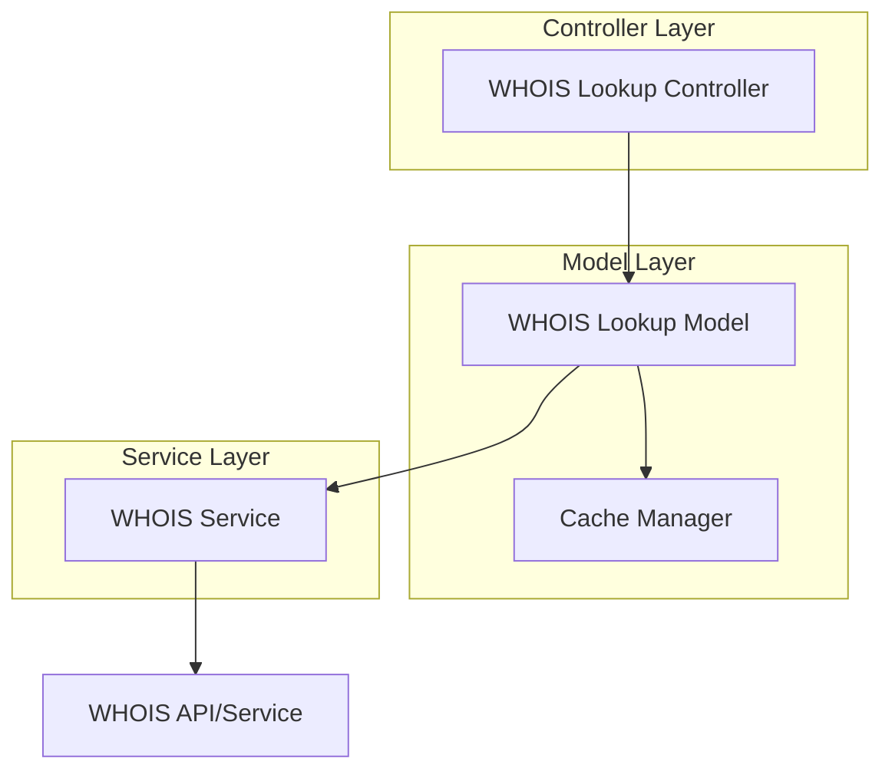

# WHOIS Lookup Feature

## 1. Introduction

The WHOIS lookup feature is a core component of the DNS MCP Server, providing users with the ability to retrieve domain registration information. This document details the design, implementation, and usage of this feature, focusing on delivering minimal but essential WHOIS information including registrar details, registration/expiration dates, and nameservers.

## 2. Feature Overview

WHOIS is a query and response protocol used for querying databases that store information about registered domain names. This feature allows users to access this information directly from their IDE, simplifying the process of domain verification and troubleshooting.

### 2.1 Key Capabilities

- Lookup WHOIS information for any valid domain
- Retrieve essential information (registrar, dates, nameservers)
- Format results in a clean, consistent manner
- Optional caching of results
- Handle privacy-protected domains gracefully

### 2.2 Use Cases

- Verifying domain ownership
- Checking domain registration and expiration dates
- Confirming registrar information
- Validating nameserver configuration
- Investigating domain history

## 3. Implementation Details

### 3.1 Component Architecture



### 3.2 Class Definitions

#### 3.2.1 WHOIS Lookup Controller

```typescript
class WHOISLookupController {
  constructor(
    private whoisLookupModel: WHOISLookupModel,
  ) {}

  async lookup(params: {
    domain: string;
    useCache?: boolean;
  }): Promise<WHOISLookupResult> {
    // Validate domain
    // Process request
    // Return formatted result
  }
}
```

#### 3.2.2 WHOIS Lookup Model

```typescript
class WHOISLookupModel {
  constructor(
    private cacheManager: CacheManager,
    private whoisService: WHOISService,
  ) {}

  async lookup(
    domain: string,
    useCache: boolean
  ): Promise<WHOISLookupResult> {
    // Check cache if enabled
    // Query WHOIS service
    // Extract relevant information
    // Update cache if enabled
    // Return result
  }
}
```

#### 3.2.3 WHOIS Service

```typescript
class WHOISService {
  async lookup(domain: string): Promise<WHOISRawData> {
    // Query WHOIS server or API
    // Parse raw WHOIS data
    // Return structured data
  }

  private parseRawData(data: string): WHOISRawData {
    // Parse raw WHOIS text data
    // Extract fields using regex patterns
    // Handle different WHOIS server formats
  }
}
```

### 3.3 Data Structures

#### 3.3.1 WHOIS Lookup Result

```typescript
interface WHOISLookupResult {
  domain: string;
  fromCache: boolean;
  timestamp: string;
  registrar: {
    name: string;
    url?: string;
    ianaId?: string;
  };
  dates: {
    created?: string;
    updated?: string;
    expires?: string;
  };
  nameservers: string[];
  privacyProtected: boolean;
  raw?: string; // Optional raw WHOIS data
}
```

#### 3.3.2 WHOIS Raw Data

```typescript
interface WHOISRawData {
  text: string;
  parsedFields: {
    [key: string]: string | string[];
  };
}
```

### 3.4 WHOIS Data Extraction

The WHOIS service will extract the following minimal information:

1. **Registrar Information**
   - Registrar name
   - Registrar URL (if available)
   - IANA ID (if available)

2. **Date Information**
   - Creation date
   - Expiration date
   - Last updated date (if available)

3. **Nameserver Information**
   - List of nameservers

### 3.5 Privacy Considerations

Many domains use privacy protection services that mask the registrant's information. The implementation will:

1. Detect privacy-protected domains
2. Indicate when privacy protection is in use
3. Still provide available information (registrar, dates, nameservers)
4. Handle different privacy service formats from various registrars

## 4. API Specification

### 4.1 MCP Tool Definition

```javascript
const whoisLookupTool = {
  name: 'whois_lookup',
  description: 'Look up WHOIS information for a domain',
  inputSchema: {
    type: 'object',
    properties: {
      domain: {
        type: 'string',
        description: 'Domain name to look up'
      },
      useCache: {
        type: 'boolean',
        description: 'Whether to use cached results if available',
        default: false
      },
      includeRaw: {
        type: 'boolean',
        description: 'Whether to include raw WHOIS data in the response',
        default: false
      }
    },
    required: ['domain']
  },
  outputSchema: {
    type: 'object',
    properties: {
      domain: { type: 'string' },
      fromCache: { type: 'boolean' },
      timestamp: { type: 'string', format: 'date-time' },
      registrar: {
        type: 'object',
        properties: {
          name: { type: 'string' },
          url: { type: 'string' },
          ianaId: { type: 'string' }
        },
        required: ['name']
      },
      dates: {
        type: 'object',
        properties: {
          created: { type: 'string', format: 'date-time' },
          updated: { type: 'string', format: 'date-time' },
          expires: { type: 'string', format: 'date-time' }
        }
      },
      nameservers: {
        type: 'array',
        items: { type: 'string' }
      },
      privacyProtected: { type: 'boolean' },
      raw: { type: 'string' }
    },
    required: ['domain', 'fromCache', 'timestamp', 'registrar', 'nameservers', 'privacyProtected']
  },
  handler: async (params) => {
    const controller = new WHOISLookupController(/* dependencies */);
    return controller.lookup(params);
  }
};
```

### 4.2 Example Request

```json
{
  "domain": "example.com",
  "useCache": false,
  "includeRaw": false
}
```

### 4.3 Example Response

```json
{
  "domain": "example.com",
  "fromCache": false,
  "timestamp": "2025-04-12T20:00:00.000Z",
  "registrar": {
    "name": "ICANN",
    "url": "https://www.icann.org",
    "ianaId": "376"
  },
  "dates": {
    "created": "1995-08-14T04:00:00Z",
    "updated": "2023-08-14T07:01:33Z",
    "expires": "2025-08-13T04:00:00Z"
  },
  "nameservers": [
    "a.iana-servers.net",
    "b.iana-servers.net"
  ],
  "privacyProtected": false
}
```

## 5. WHOIS Data Sources

### 5.1 Direct WHOIS Queries

The primary method for retrieving WHOIS data will be direct queries to WHOIS servers:

1. Determine the appropriate WHOIS server for the TLD
2. Connect to the WHOIS server (typically port 43)
3. Send the domain query
4. Parse the text response

```typescript
async function queryWhoisServer(domain: string, server: string): Promise<string> {
  return new Promise((resolve, reject) => {
    const socket = net.createConnection({ host: server, port: 43 }, () => {
      socket.write(domain + '\r\n');
    });
    
    let data = '';
    socket.on('data', (chunk) => {
      data += chunk.toString();
    });
    
    socket.on('end', () => {
      resolve(data);
    });
    
    socket.on('error', (err) => {
      reject(err);
    });
  });
}
```

### 5.2 WHOIS API Services

For improved reliability and to handle rate limiting, the implementation may also use third-party WHOIS API services:

- WHOIS API providers (e.g., WhoisXML API, WHOIS API)
- Domain registrar APIs (where available)
- RDAP (Registration Data Access Protocol) endpoints

### 5.3 WHOIS Server Mapping

The implementation will maintain a mapping of TLDs to their corresponding WHOIS servers:

```typescript
const whoisServers = {
  'com': 'whois.verisign-grs.com',
  'net': 'whois.verisign-grs.com',
  'org': 'whois.pir.org',
  'io': 'whois.nic.io',
  // Additional TLDs...
};
```

## 6. Error Handling

### 6.1 Common Errors

| Error Code | Description | HTTP Status |
|------------|-------------|-------------|
| `INVALID_DOMAIN` | Domain name is invalid | 400 |
| `DOMAIN_NOT_FOUND` | Domain does not exist | 404 |
| `WHOIS_SERVER_ERROR` | WHOIS server returned an error | 502 |
| `WHOIS_TIMEOUT` | Request to WHOIS server timed out | 504 |
| `RATE_LIMIT_EXCEEDED` | Too many requests to WHOIS server | 429 |
| `PARSING_ERROR` | Error parsing WHOIS response | 500 |

### 6.2 Error Response Example

```json
{
  "error": {
    "code": "WHOIS_SERVER_ERROR",
    "message": "Error querying WHOIS server for domain 'example.com'",
    "details": {
      "domain": "example.com",
      "server": "whois.verisign-grs.com",
      "serverMessage": "Connection refused"
    }
  }
}
```

### 6.3 Error Handling Strategy

1. Validate domain format before making WHOIS queries
2. Implement timeouts for WHOIS server connections
3. Handle server-specific errors and translate to standard error codes
4. Implement fallback mechanisms (try alternative servers or APIs)
5. Log detailed error information for debugging
6. Return user-friendly error messages

## 7. Performance Considerations

### 7.1 Response Time Targets

- P50 response time: < 1000ms
- P95 response time: < 2000ms
- P99 response time: < 3000ms

### 7.2 Optimization Strategies

1. **Caching**: Implement caching with appropriate TTL values
2. **Connection Pooling**: Maintain connection pools for frequently used WHOIS servers
3. **Timeout Management**: Set appropriate timeouts for WHOIS queries
4. **Rate Limiting**: Implement client-side rate limiting to avoid server throttling
5. **Parallel Queries**: Use fallback sources in parallel when primary source is slow

### 7.3 Caching Strategy

- Cache results based on domain
- Set default cache TTL to 24 hours (configurable)
- Allow users to bypass cache with `useCache: false`
- Implement cache invalidation for stale entries

## 8. Testing Strategy

### 8.1 Unit Tests

- Test WHOIS lookup controller with mocked dependencies
- Test WHOIS service with mocked responses
- Test parsing logic with sample WHOIS data
- Test cache manager functionality
- Test error handling scenarios

### 8.2 Integration Tests

- Test end-to-end flow with real WHOIS servers
- Test caching behavior
- Test performance under load
- Test error scenarios with real servers

### 8.3 Test Cases

1. Lookup WHOIS for valid domains across different TLDs
2. Lookup WHOIS for non-existent domains
3. Lookup WHOIS for privacy-protected domains
4. Verify caching behavior
5. Test error handling for various scenarios
6. Test performance with multiple concurrent requests

## 9. Future Enhancements

1. Support for additional WHOIS information (registrant, admin contact, etc.)
2. Historical WHOIS data tracking
3. WHOIS change notifications
4. Integration with domain registration services
5. Support for RDAP (Registration Data Access Protocol)
6. Bulk WHOIS lookups

## 10. Dependencies

- TCP socket library for WHOIS queries
- HTTP client library for API queries
- Caching library
- Validation library
- Logging framework
- Date parsing and formatting library

## 11. Security Considerations

1. Validate and sanitize all user inputs
2. Implement rate limiting to prevent abuse of WHOIS servers
3. Handle sensitive information securely
4. Use secure connections for API calls
5. Implement proper error handling to prevent information leakage
6. Respect WHOIS server usage policies